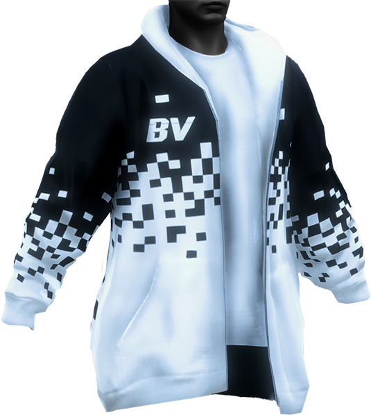
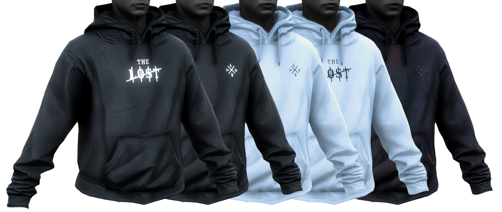
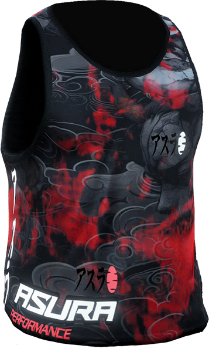
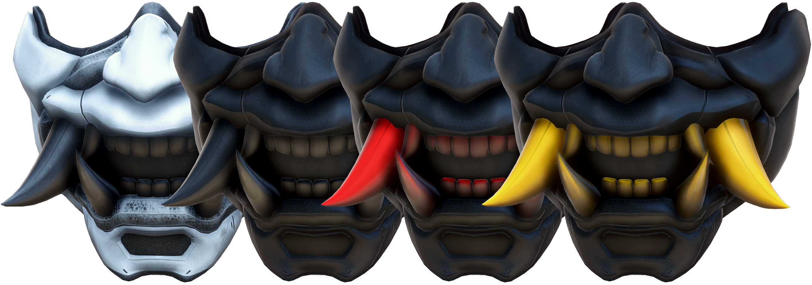

# ONX ES Clothing Update

## Face Bandana

### Model Polycount: 
- LOD H: 656 
- LOD M: 106 
- LOD L: 16

### Embedded Textures:
- Normal Map: 512x512
- Specular Map: 4x4

### YTDs: 

- Texture count: 5 
- Resolution: 1024x1024
- DDS Format: DXT1

### Vanilla DLC Location: 
`update/x64/dlcpacks/mpheist/dlc.rpf/x64/models/cdimages/mpheist_streamedpeds.rpf/mp_m_freemode_01_male_heist`

### FiveM Replace Name: 
`mp_m_freemode_01_male_heist^berd_016_u`

---

## Neck Gaiter

### Model Polycount: 
- LOD H: 944 
- LOD M: 386 
- LOD L: 68

### Embedded Textures:
- Normal Map: 1024x1024
- Specular Map: 256x256

### YTDs: 

- Texture count: 2 
- Resolution: 1024x1024
- DDS Format: BC7

### Vanilla DLC Location: 
`update/x64/dlcpacks/mpheist3/dlc.rpf/x64/models/cdimages/mpheist3_male.rpf/mp_m_freemode_01_mp_m_heist3`

### FiveM Replace Name: 
`mp_m_freemode_01_mp_m_heist3^berd_009_u`

---

## Bandana for Pants (Front)

### Model Polycount: 
- LOD H: 230
- LOD M: 36
- LOD L: 30

### Embedded Textures:
- Normal Map: 512x512
- Specular Map: 32x32

### YTDs: 

- Texture count: 2 
- Resolution: 512x512
- DDS Format: BC7

### Adapted from an existing GTA utility-belt asset, the original rag was re-sculpted and repurposed as a front‑hanging bandana.

### Vanilla DLC Location: 
`update/x64/dlcpacks/mpheist3/dlc.rpf/x64/models/cdimages/mpheist3_male.rpf/mp_m_freemode_01_mp_m_heist3`

### FiveM Replace Name: 
`mp_m_freemode_01_mp_m_heist3^accs_004_u`

---

## The Families Varsity Jacket

### Model Polycount: 
- Male LOD H: 2.898 - Female LOD H: 2.898
- Male LOD M: 1.254 - Female LOD M: 1.112
- Male LOD L: 384 - Female LOD L: 346

### Embedded Textures:
- Normal Map: 512x512
- Specular Map: 256x256

### YTDs: 

- Texture count: 2 
- Resolution: 1024x1024
- DDS Format: DXT5

### Vanilla DLC Location: 
`update/x64/dlcpacks/mp2023_01/dlc.rpf/x64/models/cdimages/mp2023_01_male.rpf/mp_m_freemode_01_mp_m_2023_01`

### FiveM Replace Name: 
`mp_m_freemode_01_mp_m_2023_01^jbib_049_u`

---

## Black Vulture Oversized Hoodie

### Model Polycount: 
- Male LOD H: 2.721 - Female LOD H: 2.721
- Male LOD M: 1.361 - Female LOD M: 1.361
- Male LOD L: 789 - Female LOD L: 751

### Embedded Textures:
- Normal Map: 512x512 
- Specular Map: 256x256

### YTDs: 

- Texture count: 1 
- Resolution: 1024x1024
- DDS Format: DXT5

### Adapted from the `G_M_Y_StrPunk_02` hoodie and refitted for `mp_m_freemode_01`; embedded textures and .ytd files were recreated for proper compatibility.

### Vanilla DLC Location: 
`x64v/models/cdimages/componentpeds_g_m_y/g_m_y_strpunk_02.ydd`

---

## The Lost Hoodie 

### Model Polycount: 
- Male LOD H: 3.194 - Female LOD H: 3.196
- Male LOD M: 626 - Female LOD M: 626
- Male LOD L: 93 - Female LOD L: 93

### Embedded Textures:
- Normal Map: 1024x1024
- Specular Map: 256x256

### YTDs: 

- Texture count: 5 
- Resolution: 1024x1024
- DDS Format: 2x DXT5 / 3x BC7

### Vanilla DLC Location: 
`update/x64/dlcpacks/mpheist/dlc.rpf/x64/models/cdimages/mpheist_streamedpeds.rpf/mp_m_freemode_01_male_heist`

### FiveM Replace Name: 
`mp_m_freemode_01_male_heist^jbib_004_u`

---

## The Lost Vintage Patched Denim Cut 
![[alt text]](Images/FjnmHaE.png)

### Model Polycount: 
- Male LOD H: 2.898 - Female LOD H: 2.808
- Male LOD M: 859 - Female LOD M: 859
- Male LOD L: 55 - Female LOD L: 55

### Embedded Textures:
- Normal Map: 1024x1024
- Specular Map: 256x256

### YTDs: 

- Texture count: 4 
- Resolution: 1024x1024
- DDS Format: BC7

### Vanilla DLC Location: 
`update/x64/dlcpacks/mpbiker/dlc.rpf/x64/models/cdimages/mpbiker_male.rpf/mp_m_freemode_01_mp_m_bikerdlc_01`

### FiveM Replace Name: 
`mp_m_freemode_01_mp_m_bikerdlc_01^jbib_016_u`

---

## Asura Tank Top - Male Only

### Model Polycount: 
- LOD H: 1.228
- LOD M: 304
- LOD L: 37

### Embedded Textures:
- Normal Map: 512x256
- Specular Map: 4x4

### YTDs: 

- Texture count: 1 
- Resolution: 1024x1024
- DDS Format: DXT5

### Vanilla DLC Location: 
`x64w.rpf/dlcpacks/mpbeach/dlc.rpf/x64/models/cdimages/mpbeach.rpf/mp_m_freemode_01_male_freemode_beach`

### FiveM Replace Name: 
`mp_m_freemode_01_male_freemode_beach^jbib_001_u`

---

## Asura T-Shirt - Female Only

### Model Polycount: 
- LOD H: 1.418
- LOD M: 658
- LOD L: 99

### Embedded Textures:
- Normal Map: 512x512
- Specular Map: 256x256

### YTDs: 

- Texture count: 1 
- Resolution: 1024x1024
- DDS Format: DXT5

### Vanilla DLC Location: 
`x64w.rpf/dlcpacks/mphipster/dlc.rpf/x64/models/cdimages/mphipster.rpf/mp_m_freemode_01_male_freemode_hipster`

### FiveM Replace Name: 
`mp_m_freemode_01_male_freemode_hipster^jbib_011_u`

---

## The Lost Biker Kutte

### Model Polycount: 
- Male LOD H: 1.232 - Female LOD H: 4.936
- Male LOD M: 268 - Female LOD M: 2.643
- Male LOD L: 37 - Female LOD L: 1.125

### Embedded Textures:
- Normal Map: 1024x1024
- Specular Map: 512x512

### YTDs: 

- Texture count: 2 
- Resolution: 1024x1024
- DDS Format: BC7

### Source: Purchased from [Classic Trimmed Vest by Bikermods](https://bikermods.com/products/classic-trimmed-vest-male) — edited and adapted for ONX Spain by Nethermost.

---

## Demon Verdict Biker Kutte

### Model Polycount: 
- LOD H: 2.296
- LOD M: 1.194
- LOD L: 512

### Embedded Textures:
- Normal Map: 1024x1024
- Specular Map: 256x256

### YTDs: 

- Texture count: 1 
- Resolution: 1024x1024
- DDS Format: BC7

### Source: Downloaded (free) from [GTA 5 Mods — Felony Biker Vest by Clutit](https://www.gta5-mods.com/player/felony-biker-vest) — edited and adapted for ONX Spain by Nethermost.

---

## American Security Vest

### Model Polycount: 
- Male LOD H: 1.650 - Female LOD H: 1.650   
- Male LOD M: 640 - Female LOD M: 642
- Male LOD L: 260 - Female LOD L: 260

### Embedded Textures:
- Normal Map: 512x512
- Specular Map: 256x256

### YTDs: 

- Texture count: 1 
- Resolution: 1024x1024
- DDS Format: DXT5

### Vanilla DLC Location: 
`update/x64/dlcpacks/mpchristmas2017/dlc.rpf/x64/models/cdimages/mpchristmas2017_male.rpf/mp_m_freemode_01_mp_m_christmas2017`

### FiveM Replace Name: 
`mp_m_freemode_01_mp_m_christmas2017^accs_009_u`

---

## Decals for Demons Verdict Biker Kutte

### Model Polycount: 
- Male LOD H: 753 - Female LOD H: 750   
- Male LOD M: 340 - Female LOD M: 250
- Male LOD L: 118 - Female LOD L: 94

### Embedded Textures:
- Normal Map: 1024x1024
- Specular Map: 32x32

### YTDs: 

- Texture count: 8 
- Resolution: 2048x2048
- DDS Format: BC7

### Using the original source as a base, the asset was reworked and transformed into decals that naturally drape and align with the biker kutte. [Source details](#source-felony-vest)

---

## Decals for The Lost Biker Kutte

### Model Polycount: 
- Male LOD H: 203 - Female LOD H: 853
- Male LOD M: 74 - Female LOD M: 386
- Male LOD L: 37 - Female LOD L: 152

### Embedded Textures:
- Normal Map: 1024x1024
- Specular Map: 64x64

### YTDs: 

- Texture count: 9 
- Resolution: 2048x2048
- DDS Format: BC7

### Using the original source as a base, the asset was reworked and transformed into decals that naturally drape and align with the biker kutte. [Source details](#source-classic-vest)

---

## News Press Pass Card

### Model Polycount: 
- Male LOD H: 498
- Male LOD M: 230
- Male LOD L: 98

### Embedded Textures:
- Normal Map: 4x4
- Specular Map: 256x256

### YTDs: 

- Texture count: 2 
- Resolution: 512x512
- DDS Format: DXT1

### Vanilla DLC Location: 
`update/x64/dlcpacks/mp2024_01/dlc.rpf/x64/models/cdimages/mp2024_01_male.rpf/mp_m_freemode_01_mp_m_2024_01`

### FiveM Replace Name: 
`mp_m_freemode_01_mp_m_2024_01^teef_013_u`

---

## TonyHiits Oni Mask

### Model Polycount: 
- LOD H: 9.528
- LOD M: 4.599
- LOD L: 1.253

### Embedded Textures:
- Normal Map: 1024x1024
- Specular Map: 512x512

### YTDs: 

- Texture count: 4 
- Resolution: 1024x1024
- DDS Format: BC7

### Licensing & Credits

- **Source:** Asset purchased from Fab — [Cyberpunk Oni Mask by Alternative Universe](https://www.fab.com/listings/c16cb417-7e71-46a1-b598-d50c4562388a) (Personal / Fab Standard License). Permitted: commercial and private use, modification, and distribution as part of this project; **prohibited:** standalone resale or free redistribution. See the Fab EULA for full terms.
- **Author / Modifications:** Modified, remade for compatibility, and incorporated into this project by **Nethermost** (adapted for use as a GTA V asset).

---

## Demon Verdict Low Beanie

### Model Polycount: 
- LOD H: 1.100

### Embedded Textures:
- Normal Map: 512x512
- Specular Map: 256x256

### YTDs: 

- Texture count: 1 
- Resolution: 1024x1024
- DDS Format: BC7

### Vanilla DLC Location: 
`update/x64/dlcpacks/mpsmuggler/dlc.rpf/x64/models/cdimages/mpsmuggler_male_p.rpf/mp_m_freemode_01_p_mp_m_smuggler_01`

### FiveM Replace Name: 
`mp_m_freemode_01_p_mp_m_smuggler_01^p_head_008`